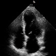
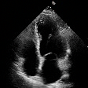
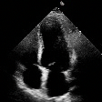
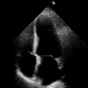
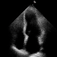
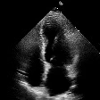
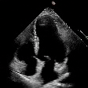
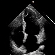

# EchoDiffusion

This repository contains the code for the paper *Feature-Conditioned Cascaded Video Diffusion Models for Precise Echocardiogram Synthesis*. Hadrien Reynaud, Mengyun Qiao, Mischa Dombrowski, Thomas Day, Reza
  Razavi, Alberto Gomez, Paul Leeson and Bernhard Kainz. 2023.

This README is divided into the following sections:
- [EchoDiffusion](#echodiffusion)
- [Requirements](#requirements)
- [Usage](#usage)
  - [1. Setup this repository](#1-setup-this-repository)
  - [2. Train the reference ejection fraction regression model](#2-train-the-reference-ejection-fraction-regression-model)
  - [3. Train diffusion models](#3-train-diffusion-models)
  - [4. Evaluate diffusion models](#4-evaluate-diffusion-models)
    - [4.1. Compute MAE, RMSE, $R^2$, SSIM and LPIPS](#41-compute-mae-rmse-r2-ssim-and-lpips)
    - [4.2. Compute FID and FVD](#42-compute-fid-and-fvd)
  - [5. Train ejection fraction regression models on ablated and generated data](#5-train-ejection-fraction-regression-models-on-ablated-and-generated-data)
- [Results](#results)
- [Acknowledgements](#acknowledgements)
- [Citation](#citation)
  

# Requirements
All the code is written in Python 3.10.8. The requirements are listed in the file `requirements.txt`. To install them, run the following command:

    pip install -r requirements.txt

# Usage
The code is divided into two parts: the ejection fraction regression models and the diffusion models.
The order of execution should be:
1. Setup this repository
2. Train the reference ejection fraction regression model
3. Train diffusion models
4. Evaluate diffusion models
5. Train ejection fraction regression models on abalted and generated data

## 1. Setup this repository
- To setup this repository, first download the EchoNet-Dynamic dataset https://echonet.github.io/dynamic/index.html#access. Unzip the file in folder `data`. The only item in the `data` folder should be the folder named `EchoNet-Dynamic`.
- Make sure you have installed the `requirements`.

## 2. Train the reference ejection fraction regression model
The reference ejection fraction regression model is trained on the EchoNet-Dynamic dataset. To train it, run the following command:

    python ef_regression/train_reference.py --config ef_regression/config_reference

## 3. Train diffusion models
The diffusion models are trained on the EchoNet-Dynamic dataset. We provide configuration files for 1SCM, 2SCM and 4SCM cascaded diffusion models. To train them, you can run the following command:

    python diffusion/train.py --config diffusion/configs/1SCM.yaml --stage 1 --bs 4 --ignore_time 0.25

where `--stage` is the stage of the cascaded diffusion model, `--bs` is the batch size and `--ignore_time` is the chance of ignoring the time dimension in the input.
This command will run the training on a single gpu. To run the training on multiple gpus, you can use the following command:

    accelerate launch --multi_gpu --num_processes=8 diffusion/train.py --config diffusion/configs/1SCM.yaml --stage 1 --bs 4 --ignore_time 0.25

where `--num_processes` is the number of gpus to use. 

We also provide slurm scripts to launch the training of all the models described in our paper on a similar cluster. Scripts are located in `diffusion/slurms` and can be launched with the following commands: 

    sbatch diffusion/train_1SCM_stage1.sh

We used clusters of 8x NVIDIA A100 GPUs with 80GB of VRAM to train the models. Each stage was train for approximately 48 hours.


## 4. Evaluate diffusion models

We evaluate the diffusion models on two sets of metrics to get quantitavve estimates of:
- The accuracy in the ejection fraction of the generated video compared to the ejection fraction requested as a conditionning (MAE, RMSE, $R^2$)
- The image quality of the generated videos (SSIM, LPIPS, FID, FVD)

### 4.1. Compute MAE, RMSE, $R^2$, SSIM and LPIPS
All the code necessary to compute these metrics is located in the `evaluate` folder. The easiest way to compute these metrics to run:

    python diffusion/evaluate/generate_score_file_chunk.py --model path/to/model --bs 4 --num_noise 3 --chunks  --save_videos --rand_ef

where `--model` is the path to the model to evaluate, `--bs` is the batch size, `--num_noise` is the number of time we resample the same video and use the ejection fraction feeback loop to keep the best score, `--save_videos` is a flag to save the generated videos and `--rand_ef` is a flag to generate videos with random ejection fractions instead of the ejection fractions corresponding to the anatomy of the patient used as conditioning.

As generating videos can take a long time, we provide a script to launch the generation of videos on multiple gpus. To launch the generation of videos on 8 gpus, edit diffusion/evaluate/generate_score_file_chunk.sh to set the path to a model and run:

    sbatch diffusion/evaluate/generate_score_file_chunk.sh

In both cases, the script will generate a `csv` file. To compute the actual metrics, run:

    python diffusion/evaluate/compute_metrics.py --model path/to/model

This will compute: MAE, RMSE, $R^2$, SSIM and LPIPS, and display the results in the terminal.

### 4.2. Compute FID and FVD

To compute FID and FVD, we use the [StyleGAN-V](https://github.com/HReynaud/stylegan-v) repo ([original repo here](https://github.com/universome/stylegan-v)).
To get the FID and FVD scores:
1. Clone the [StyleGAN-V](https://github.com/HReynaud/stylegan-v) repository, and install the requirements (compatible with the requirements of this repo).
2. We provide a script to prepare the videos generated with `generate_score_file_chunk.py`. That script expects the following file tree:

```
MODEL (ex. 1SCM)
├───factual
│   ├───images
│   │   ├───real
│   │   │   image001.txt
│   │   │   image002.txt
│   │   │   ...
│   │   └───fake
│   │       image001.txt
│   │       image002.txt
│   │       ...
│   └───videos
│       video001.txt
│       video002.txt
│       ...
└───counterfactual
    ├───images
    │   ├───real
    │   │   image001.txt
    │   │   image002.txt
    │   │   ...
    │   └───fake
    │       image001.txt
    │       image002.txt
    │       ...
    └───videos
        video001.txt
        video002.txt
        ...
```

3. You should copy all the generated videos of that model in the corresponding folder *ie* `counterfactual/videos` if you used the `--rand_ef` flag, and `factual/videos` otherwrise. Then set `root_dir` to the `counterfactual` folder path or factual `folder` path in `split_videos_into_real_fake.sh` and run:


```
sh diffusion/evaluate/scripts/split_videos_into_real_fake.sh
```

This will populate the `images/real` and `images/fake` folder with the frames of the videos. Now you can run the FID and FVD metric computation with:

```
cd stylegan-v

python src/scripts/calc_metrics_for_dataset.py --real_data_path path/to/images/real --fake_data_path path/to/images/fake --mirror 0 --gpus 1 --resolution 128 --metrics fvd2048_16f,fid50k_full
```

This will take a few minutes to run depending on the number of videos you generated. Results are printed in the terminal.

For reference, we obtained the following metrics for our models:


| Model | Task           | Resolution | Frames | Sampling time | R2   | MAE  | RMSE | SSIM | LPIPS | FID  | FVD  |
|-------|----------------|------------|--------|---------------|------|------|------|------|-------|------|------|
| 1SCM  | Generation     | 112 x 112  | 16     | 62s           | 0.64 | 9.65 | 12.2 | 0.53 | 0.21  | 12.3 | 60.5 |
| 2SCM  | Generation     | 112 x 112  | 32     | 146s          | 0.89 | 4.81 | 6.69 | 0.53 | 0.24  | 31.7 | 141  |
| 4SCM  | Generation     | 112 x 112  | 32     | 279s          | 0.93 | 3.77 | 5.26 | 0.48 | 0.25  | 24.6 | 230  |
| 1SCM  | Reconstruction | 112 x 112  | 16     | 62s           | 0.76 | 4.51 | 6.07 | 0.53 | 0.21  | 13.6 | 89.7 |
| 2SCM  | Reconstruction | 112 x 112  | 32     | 146s          | 0.93 | 2.22 | 3.35 | 0.54 | 0.24  | 31.4 | 147  |
| 4SCM  | Reconstruction | 112 x 112  | 32     | 279s          | 0.90 | 2.42 | 3.87 | 0.48 | 0.25  | 24.0 | 228  |

## 5. Train ejection fraction regression models on ablated and generated data

We explored the impact of rebalancing the dataset on the performance of the regression models. This was achived by generating additional videos with the diffusion models (4SCM) given a list of pre-generated ejection fractions. That list was generated by using the `ef_regression/ef_balancing.ipynb` notebook. The notebook will generate a `csv` file with the ejection fractions to use for each video. We then used the `diffusion/generate_samples/generate_dataset.py` script to generate the videos (slurm script available for distributed generation). The script generates videos conditionned on random anatomies of the training set while going through the list of requested ejection fractions. A summary `csv` file is generated, which contains the video names, corresponding anatomy, target ejection fraction and regressed ejection fraction.

Those videos should be moved the `data/balancing_samples/videos` folder and the report `csv` file should be moved to `data/balancing_samples/`. 

To train the regression models on the generated data, we used 
1. The `ef_regression/train_balanced.py` script to train all the config files in `ef_regression/config_balance` that start with `balance_`, as well as the `all_samples.yaml` file. 
2. The config files starting with `resample_` should be called with the `ef_regression/train_reference.py` script.
This let us train the models on the re-balanced dataset, as well as on the original dataset with resampled ejection fractions.

# Results

Our diffusion models can generate 2 seconds long videos, conditioned on one image and an ejection fraction.

| Model | Original |   Factual   | Counterfactual |
| ----- | ------------ |   -------   | -------------- |
| 1SCM  |  |  |  |
| 2SCM  |  |  |  |
| 4SCM  |  |  |  |

# Acknowledgements

This work was supported by Ultromics Ltd. and the UKRI Centre for Doctoral Training in Artificial Intelligence for Healthcare (EP/S023283/1).
The authors gratefully acknowledge the scientific support and HPC resources provided by the Erlangen National High Performance Computing Center (NHR@FAU) of the Friedrich-Alexander-Universität Erlangen-Nürnberg (FAU) under the NHR project b143dc PatRo-MRI. NHR funding is provided by federal and Bavarian state authorities. NHR@FAU hardware is partially funded by the German Research Foundation (DFG) – 440719683.


# Citation
```
@misc{reynaud2023featureconditioned,
      title={Feature-Conditioned Cascaded Video Diffusion Models for Precise Echocardiogram Synthesis}, 
      author={Hadrien Reynaud and Mengyun Qiao and Mischa Dombrowski and Thomas Day and Reza Razavi and Alberto Gomez and Paul Leeson and Bernhard Kainz},
      year={2023},
      eprint={2303.12644},
      archivePrefix={arXiv},
      primaryClass={cs.CV}
}
```


